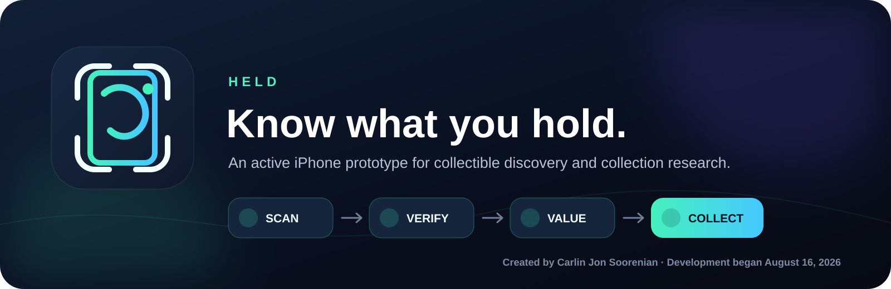
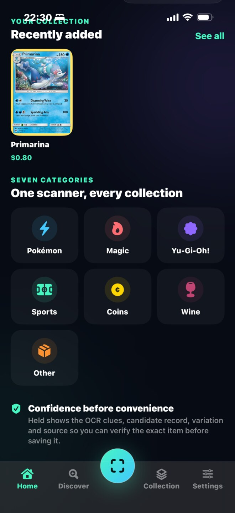
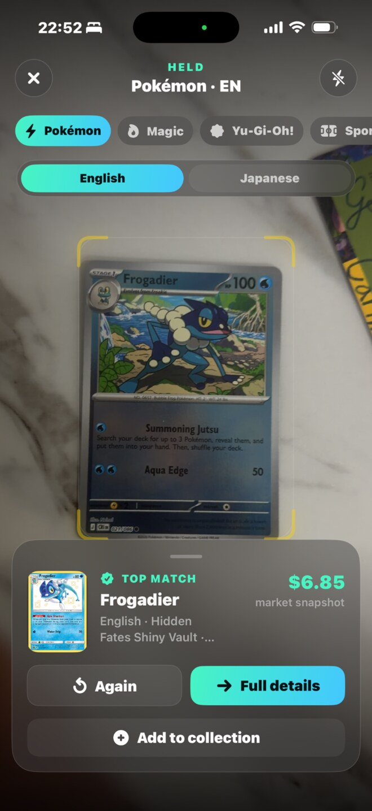
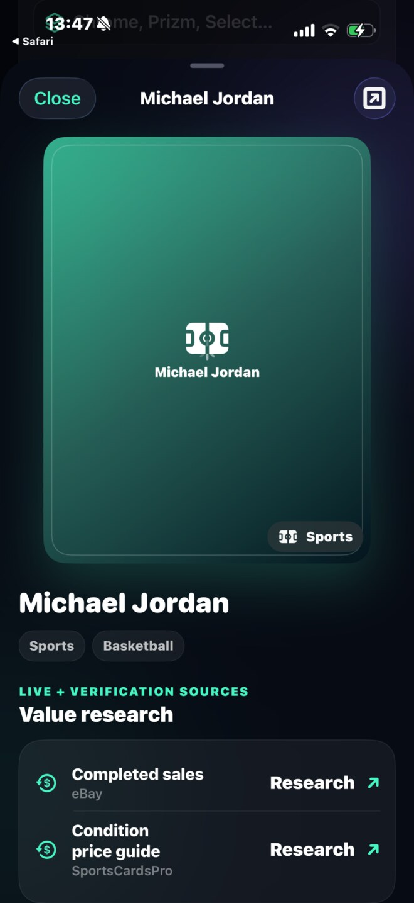

  

<em>Public product showcase · Private implementation</em>

Held is an iPhone-first collectible companion designed to help people identify, verify, research, and organize the things they hold in their hands—from trading cards and sports cards to coins, wine, and other labeled collectibles.

**Created and product-directed by Carlin Jon Soorenian. Development began August 16, 2026.**

> **This is a showcase repository, not an open-source project.** The application source code, Xcode project, scanning pipeline, matching logic, and provider integrations are maintained privately. All rights are reserved. See [NOTICE.md](NOTICE.md).

## The product

Collectors should not need five different apps and a long manual search just to understand one item. Held brings scanning, catalogue research, market context, and personal collection tracking into one focused experience.

The current prototype follows one clear workflow:

| Scan | Verify | Value | Collect |
| --- | --- | --- | --- |
| Capture category-specific identity clues | Confirm the printing, variation, language, year, or model | Show available market context or an honest research path | Save the verified copy and its details locally |

## Current prototype

| Item | Status |
| --- | --- |
| Version | Held 2.4.4 (build 7) |
| Platform | iPhone / SwiftUI |
| Minimum target | iOS 17 |
| Development status | Active iPhone prototype |
| Public distribution | Portfolio and product evaluation only |
| App Store | Not submitted |

## What Held does

- Opens directly into fast, category-specific scanning
- Provides specialized scan and research modes for Pokémon, Magic, Yu-Gi-Oh!, sports cards, coins, wine, and other labeled collectibles
- Supports English and Japanese Pokémon scanning, with additional Western-language recognition fallbacks
- Preserves collector numbers and other print identifiers to distinguish sets, reprints, and variations
- Recognizes special Pokémon name families including ex, EX, V, VMAX, VSTAR, V-UNION, GX, BREAK, LV.X, Radiant, Mega, and Tera
- Extracts sports-card clues such as player, year, brand, set, card number, rookie, autograph, parallel, and serial numbering
- Returns multiple catalogue candidates when a connected provider has many possible matches
- Shows catalogue evidence, research paths, and market sources instead of inventing unavailable prices
- Stores a personal collection with quantity, condition, purchase details, grading information, and known value
- Keeps the current prototype's collection data locally on the device

## Product principles

- **Speed with evidence:** a fast answer should still show why it matched.
- **Exact printing over a loose guess:** collector number, set size, language, variation, and other identifiers matter.
- **No fabricated values:** when a reliable quote is unavailable, Held provides research paths and asks the user to verify.
- **Collector control:** users can correct, confirm, and save the details that matter to their copy.
- **One product, specialized modes:** cards, coins, wine, and other collectibles share a home while retaining category-specific recognition.

## Current coverage

| Category | Prototype behavior |
| --- | --- |
| Pokémon | Catalogue-backed matching with collector-number, language, set, and special-title handling |
| Magic and Yu-Gi-Oh! | Catalogue-backed card discovery and available marketplace fields |
| Sports cards | OCR identity clues plus catalogue candidates when the sports provider is connected |
| Coins | OCR-guided research with optional Numista catalogue matching when configured |
| Wine | Label research against a community product catalogue |
| Other | Flexible OCR research record with completed-sales and market-search paths; not a universal exact-match API |

The prototype does not claim professional grading, authentication, counterfeit detection, or guaranteed valuation. Exact results depend on the visible evidence, catalogue coverage, provider availability, and the condition and variation of the physical item.

## Prototype gallery

  
  
  

## Development history

The public milestone record is available in [PROJECT_HISTORY.md](PROJECT_HISTORY.md). The complete source and detailed development history are retained privately.

## Ownership and collaboration

Held was created and is product-directed by **Carlin Jon Soorenian**. This repository exists to present the product, document its development, and support legitimate evaluation or collaboration without publishing its private implementation.

For investment, licensing, product collaboration, engineering collaboration, or other authorized use, contact Carlin through the [carlin335 GitHub profile](https://github.com/carlin335).

**© 2026 Carlin Jon Soorenian. All rights reserved.** No open-source license is granted.
